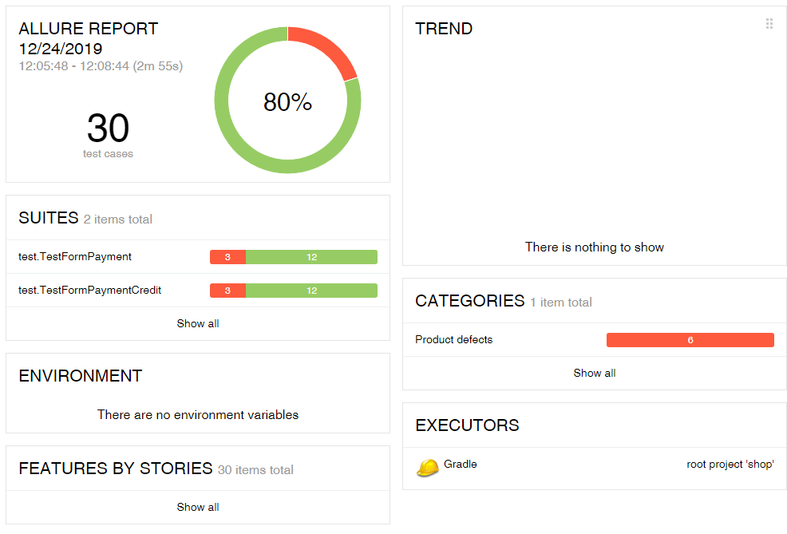

# Отчет по итогам тестирования
### Краткое описание
Была проведена работа по автоматизации тестирования приложения для оплаты тура согласно [плана автоматизации](Plan.md).  

Были написаны:
* Позитивные и негативные UI тесты
* Позитивные и негативные API тесты
* Тесты для проверки записей в БД

### Количество тест-кейсов
* Всего: 32 теста
* Успешных: 25 (78%)
* Неуспешных: 7 (22%)

### Общие рекомендации
#### Найденные баги
* [При вводе данных неактивной (DECLINE) карты производится операция покупки](https://github.com/Netology-Korolchuk/qa1-diploma/issues/3)
* [При вводе невалидных данных в поле "Владелец" активной (APPROVED) карты производится операция покупки](https://github.com/Netology-Korolchuk/qa1-diploma/issues/4)
* [При вводе невалидных данных в поле "CVV" активной (APPROVED) карты производится операция покупки](https://github.com/Netology-Korolchuk/qa1-diploma/issues/5)
* [При совершении операции покупки неизвестной картой появляются два сообщения: об ошибке и успешной операции](https://github.com/Netology-Korolchuk/qa1-diploma/issues/6)
* [При совершении операции покупки в кредит активной (APPROVED) и неактивной (DECLINE) картой не создается запись в поле credit_id таблицы order_entity](https://github.com/Netology-Korolchuk/qa1-diploma/issues/7)

#### Рекомендации
* Необходимо исправить все найденные баги
* Сделать обязательную валидацию необходимых полей

